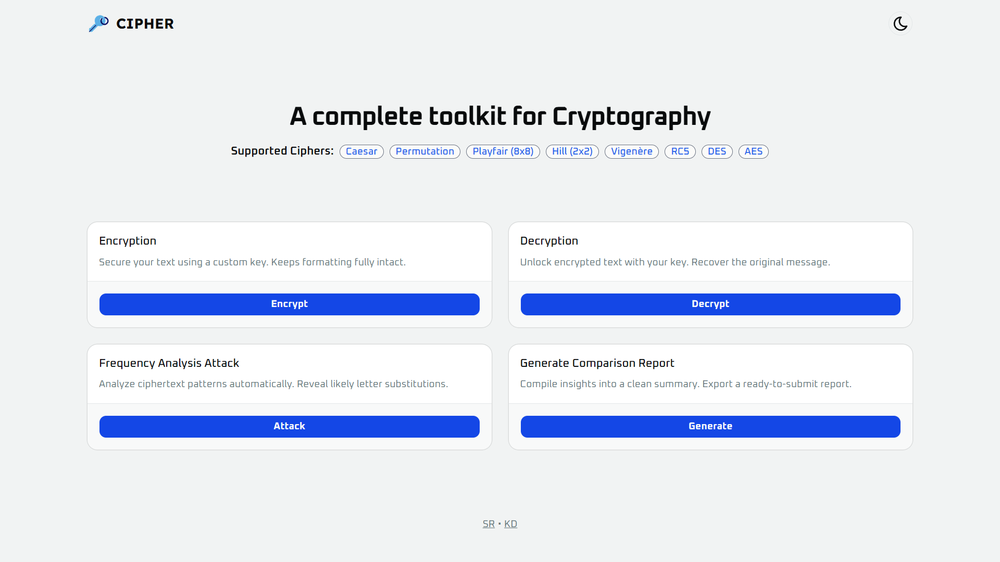

<h1 align="center">
  
  <br>
  <b>Cipher</b>
</h1>

<p align="center">
  <a href="https://cipher.hirishi.in"><b>Cipher</b></a> is your all-in-one toolkit for classic cryptography. Built with a <a href="https://nextjs.org"><b>Next.js</b></a> frontend and a <a href="https://fastapi.tiangolo.com"><b>FastAPI</b></a> backend, it lets you <b>Encrypt</b>, <b>Decrypt</b>, run <b>Frequency Analysis Attacks</b>, and generate detailed <b>Reports</b> - all from a clean & modern interface.
</p>

---

## 🔑 _Supported Ciphers_

| CIPHER                    | KEY TYPE               | ENCRYPTION / DECRYPTION | FREQUENCY ANALYSIS ATTACK |
| ------------------------- | ---------------------- | ----------------------- | ------------------------- |
| **Caesar Cipher**         | Integer Shift          | ✅ Supported            | ✅ Supported              |
| **Permutation Cipher**    | Permutation Alphabetic | ✅ Supported            | ✅ Supported              |
| **Vigenère Cipher**       | Polyalphabetic         | ✅ Supported            | ✅ Supported              |
| **Playfair Cipher (8x8)** | Alphanumeric           | ✅ Supported            | ❌ Unsupported            |
| **Hill Cipher (2x2)**     | Numeric Matrix         | ✅ Supported            | ✅ Supported              |
| **DES**                   | 64 bit Hex             | ✅ Supported            | ❌ Unsupported            |
| **AES**                   | 128/192/256 bit Hex    | ✅ Supported            | ⚠️ Impossible             |
| **RC5**                   | 16/32/64 bit Hex       | ✅ Supported            | ⚠️ Impossible             |

---

## 🎯 _System Overview_

Cipher uses a decoupled architecture with a **Next.js** frontend and a **FastAPI** backend, connected over REST with real-time **SSE streaming** for frequency analysis attacks. All 8 cipher implementations live in the modular `cipher/` Python package, each handling encrypt, decrypt, key generation, and (where applicable) attack logic independently.



---

## 🏗️ _Architecture_

| #   | COMPONENT         | DESCRIPTION                                     | STACK                                                                |
| --- | ----------------- | ----------------------------------------------- | -------------------------------------------------------------------- |
| 1️⃣  | **Frontend**      | Pages for encrypt, decrypt, attack & report     | **_TypeScript_**, **_Next.js_**, **_Tailwind CSS_**, **_shadcn/ui_** |
| 2️⃣  | **Backend**       | REST API handling all cipher operations         | **_Python_**, **_FastAPI_**, **_Uvicorn_**                           |
| 3️⃣  | **Cipher Core**   | Implementations of all 8 supported ciphers      | **_Python_**                                                         |
| 4️⃣  | **Attack Engine** | Frequency analysis with real-time SSE streaming | **_FastAPI SSE_**, **_Python_**                                      |
| 5️⃣  | **Report**        | Generates downloadable comparison reports       | **_FastAPI_**, **_Next.js_**                                         |

---

## 📁 _Project Structure_

```
Cipher/
├── frontend/               # Next.js frontend
│   ├── app/                # Pages
│   │   ├── page.tsx        # Home
│   │   ├── encrypt/        # Encryption page
│   │   ├── decrypt/        # Decryption page
│   │   ├── attack/         # Frequency analysis attack page
│   │   ├── report/         # Report generation page
│   │   ├── not-found.tsx   # Not found page
│   │   └── layout.tsx      # Root layout
│   ├── components/         # UI components (shadcn) + custom components
│   ├── lib/                # Utilities (cn.ts)
│   ├── hooks/              # Custom React hooks
│   └── public/             # Static assets
├── backend/                # FastAPI backend
│   └── app/
│       ├── main.py         # FastAPI app entry point
│       ├── config.py       # App configuration
│       ├── routes/         # API route definitions (one file per cipher)
│       ├── cipher/         # Cipher implementations
│       │   ├── caesar/     # Caesar cipher (encrypt, decrypt, attack)
│       │   ├── permute/    # Permutation cipher
│       │   ├── vigenere/   # Vigenère cipher
│       │   ├── playfair/   # Playfair cipher (8x8)
│       │   ├── hill/       # Hill cipher (2x2)
│       │   ├── des/        # DES
│       │   ├── aes/        # AES
│       │   ├── rc5/        # RC5
│       │   └── report.py   # Report generation
│       └── static/         # Static files
├── README.md
└── .gitignore
```

---

## 📖 _Instructions_

For detailed setup and usage instructions, refer to the respective README files:

- 🖥️ [**_`Backend Instructions`_**](./backend/README.md) - Setting up & running the FastAPI backend
- 🌐 [**_`Frontend Instructions`_**](./frontend/README.md) - Setting up & running the Next.js frontend

---

<p align="center">
  Made with 🔑 by <a href="https://hirishi.in">Saptarshi Roy</a> & <a href="https://itskdhere.com">Krishnendu Das</a>
</p>
